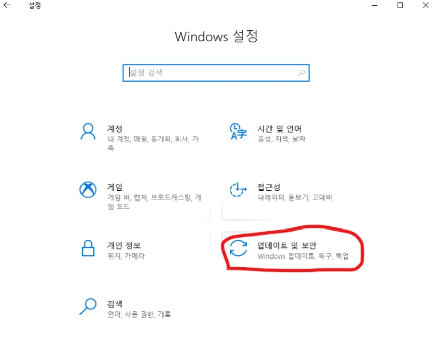

윈도우에서 리눅스(우분투)를 설치하고 우분투 터미널을 직관적이고 효율적으로 이용하는
방법을 포스팅합니다.

(**WSL = Windows subsystem Linux**)

---

# 🚀 WSL 설치 조건 확인하기.

## 🔨 설치 조건

1. Windows 10 version 1607이상
2. 아키텍쳐 x64 (64비트 운영체제)

## 🔨 Windows 버전 확인하는 방법

1.  + I

2. 시스템 클릭


3. 정보 클릭


- Windows 10 버전 1607이상인지 확인하기

  버전이 1607 이하일 경우 윈도우 업데이트 후에 진행해주시길 바랍니다.  
   또한 아키텍쳐가 64비트가 아닐 경우 윈도우를 다시 설치해주시길 바랍니다.

  ***

# 🚀 WSL설치 환경설정 그리고 설치까지

WSL 버전이 충족됐으면 설치할 수 있는 두 가지 조건을 만족해야 합니다.  
첫 번째는 Linux용 Windows 하위 시스템을 열어주는 것이고,  
두 번째는 Windows 개발자 모드 활성화를 하는 것입니다.

## 🔨 Linux용 Windows 하위시스템

1.  + Q
2. "제어판" 검색 후 제어판 실행


3. 프로그램 클릭


4. "프로그램 및 기능" 클릭


5. "Windows 기능 켜기 / 끄기" 클릭


6. "Linux용 Windows 하위 시스템" 체크 후 확인


## 🔨 Windows 개발자 모드 활성화

1.  + I
2. "업데이트 및 보안" 클릭



3. 개발자 모드 켜기

- "개발자용" 클릭
- "개발자모드" 체크


##### 축하드립니다. WSL설치 환경 설정 완료

지금부터는 WSL용 Ubuntu를 설치해보록 하겠습니다.  
우분투는 누구나 무료로 사용할 수 있는 오픈소스이며,

---

# 🚀 우분투(Ubuntu) 설치

1.  + I
2. "Microsoft Store" 검색 후 실행


3. 우분투 검색 후 실행

- "검색 클릭"
- "Ubuntu" 검색
  

검색을 하게 되면

> Ubuntu

> Ubuntu 18.04 LTS

> Ubuntu 20.04 LTS

3가지가 보이실 겁니다.
Ubuntu + 숫자 + (LTS)  
숫자 = 버전 (년.월)  
LTS = Long Term Service

( \*LTS 버전은 5년동안 업데이트를 지원합니다.)

예시) Ubuntu 18.04 LTS  
18년 04월 이후로 5년동안 업데이트를 지원하는 우분투 서버

숫자도 LTS도 붙지 않은 Ubuntu는  
현재 20.04버전을 지원합니다.

아무 버전이나 다운받아도 무관합니다.  
**저는 "Ubuntu"를 다운받겠습니다.**

##### 다운받은 Ubuntu를 실행해줍니다.


```bash
"Installing, this may take a few minutes..."
```

위의 글자가 나오면 성공  
그렇지 않으면 => 윈도우 재실행 후 Ubuntu프로그램 실행.

```bash
"Enter new UNIX username:_"
```

사용자 계정을 입력해주시면 됩니다.

```bash
"Enter new UNIX password"
```

계정을 입력했으니 비밀번호를 입력 후 엔터  
**비밀번호 입력 시 화면이 바뀌지 않습니다.**  
화면이 바뀌지 않더라도 정상입력 되고 있으니 계속 입력해주시면 됩니다.

```bash
"Retype new UNIX password"
```

비밀번호를 재입력 한 뒤 엔터를 눌러주시면 됩니다.

우분투를 설치한 뒤 사용자 계정과 비밀번호를 설정했습니다.  
살면서 회원가입을 셀 수 없이 해왔기 때문에, 너무나도 쉽습니다.  
리눅스에서는 비밀번호를 입력할 때, 화면이 바뀌지 않는다는 점이 좀 어렵게 느껴질 수 있지만,  
적응한다면 아무것도 아닙니다.  
오늘은 \*\*\*\*\* <-요녀석이 참 편리하다 깨닫게 되는 날입니다.

글이 길어졌기 때문에 다음 글에서 이어가도록 하겠습니다.  
감사합니다.
